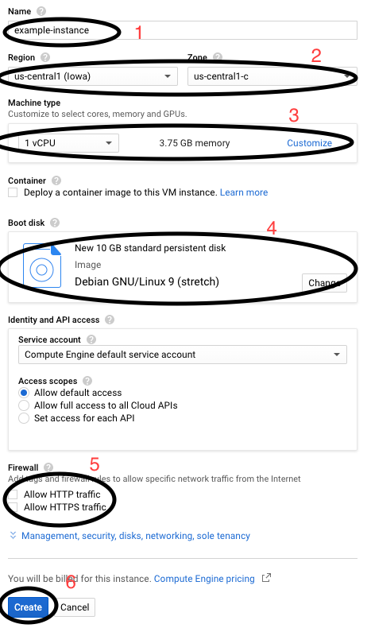
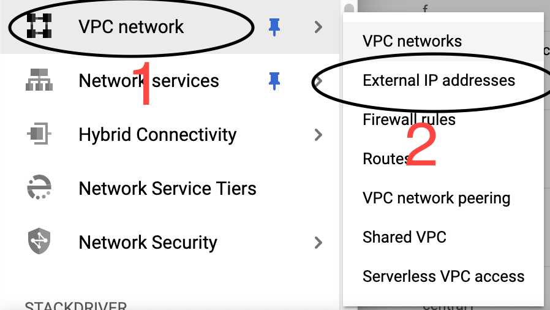

# Monitor Karewa Web

Bienvenido a Monitor Karewa Web

Este proyecto busca presentar información pública de contrataciones realiazadas por instituciones públicas, a través de 
una plataforma accesible y de código abierto que puede ser usada por instituciones locales, estatales y nacionales en 
México.

Nuestros principales objetivos son los siguientes:
- Código libre - Extender el alcance de la plataforma a través de un repositorio de código abierto y orientado a la comunidad.
- Replicabilidad - Permitir a cualquier institución pública tener su propia instancia, ofreciendo herramientas y guías en como hacerlo.
- Usabilidad - Empoderar a los ciudadanos con una plataforma accesible desde cualquier lugar, con un enfoque en la accesibilidad y experiencia de usuario.
 
 # Implementación rápida (sin configuración)
 
 Puedes crear una nueva instancia de Monitor Karewa en Heroku usando el siguiente botón. Recuerda antes [crear una cuenta gratuita en Heroku](https://signup.heroku.com/).
 
 [](https://heroku.com/deploy?template=https://gitlab.com/karewa/monitor.git)
 
 **NOTA**: Por limitaciones de Heroku, este servicio solo se encuentra disponible desde GitHub: https://github.com/monitor-karewa/monitor
 

## Plataforma

La plataforma usa las siguientes tecnologías:

- **Lenguajes**: Javascript, Pug (antes Jade), CSS, HTML
- **Platformas**: NodeJS, VueJS
- **Manejo de peticiones**: ExpressJS
- **Base de datos**: MongoDB
- **ODM**: Mongoose


Repositorio en GitLab: https://gitlab.com/karewa/monitor

Repositorio GitHub (mirror): https://github.com/monitor-karewa/monitor

Guía de usuario: https://gitlab.com/karewa/monitor/wikis/home


# Instalación (desarrollo)

Decargar el proyecto y ejecutar el siguiente comando para instalar las dependencias desde la carpeta raíz:

    `npm install`

## Servidor

Para correr el servidor:

    `npm start`

El servidor estará disponible en el puerto 3000 (por defecto).

Para correr el servidor en un puerto distinto:
    `PORT=3001 npm start`
    
    
La configuración del servidor está disponible en el archivo `/src/server/config/config.js`

## Cliente

Para correr el cliente:

    `npm run serve`

El cliente estará disponible en el puerto 8080 (por defecto).

La dirección de la API y otras variables de entorno se encuentran definidos en el archivo `.env.development`

## Compilación para producción

Compilar y minificar cliente para producción

    `npm run build`

Correr servidor en modo producción

    `NODE_ENV=production npm start`


## Generador de catálogos

Para instalar el generador de yeoman personalizado para generar catálogos base:

    npm link ./generators/generator-mkw

Para crear el catálogo:

    yo generator-mkw:catalog

Después introduce el nombre del catálogo y el generador creará los archivos base de modelo, controlador y rutas.
> **Nota**: Es necesario agregar las rutas a la configuración del servidor y personalizar el modelo


# Configuracion avanzada de servidor

## CREAR INSTANCIA EN GOOGLE Y CONFIGURACIÓN DE DOCKER COMPOSE

#### PARTE CREAR INSTANCIA
1. Después de haber iniciado sesión en nuestro proyecto GCP.
2. Antes de crear una instancia asegurar de que exista el firewall habilitado de "default-allow-ssh". Para poder entrar por ssh. En dado caso de no tener, crear la regla aplicando para todas las instancias de la siguiente manera:
    1. Seleccionar el recurso "Firewall rules", dentro de "VPC network". Del menú de la izquierda.
 
    <center></center>
 
    2. Seleccionar "CREATE FIREWALL RULE".
 
    <center></center>
 
    3. Hacer la configuración general para firewall.
        1. Agregar nombre a Firewall.
        2. Dirección de trafico "ingress".
        3. En la parte de "Targets", seleccione en "All instances in the network".
        4. En "source filter", debe ser 0.0.0.0/0, para que se puedas entrar de diferentes ip.
        5. En "Protocol and ports" debe ser por tcp y puerto 22.
  
Al final damos "create".
 
<center></center>
 
2. Seleccionar el recurso "VM Instances", dentro de "Compute Engine". Del menú de la izquierda.

<center></center>

3. Seleccionar "CREATE INSTANCE".

<center></center>

4. Dentro de este se abrirá la opción para poder configurar la instancia. Configurando de la siguiente manera:
    1. Introducir nombre de instancia.
    2. Introducir región y zona de instancia. Esto toma efecto solo sobre el data center seleccionado. Como recomendación para seleccionar el adecuado seleccionar el mas cercano a los usuarios.
    3. Introducir tipo de maquina. En este paso podemos seleccionar varios tipos preconfigurado por Google o personalizarlo. Elegir el mas adecuado para la tarea.
    4. Seleccionar sistema operativo ha instalar en instancia.
    5. Seleccionar permitir trafico por HTTP y HTTPS.  Si se permite acceso por http y https es para que cualquier servicio que trabaje sobre estos protocolos en la "instancia VM" funcione hacia el exterior. Para configurar otros puertos se debe configurar tu propia regla de firewall, como se hizo en el paso 2.
    6. Para finalizar seleccionamos "Create".

<center></center>

7. Seleccionar el recurso "External IP addresses", dentro de "VPC network". Del menú de la izquierda

  <center></center>

8. Seleccionar "RESERVE STATIC ADDRESS"

<center></center>

9. Configurar la ip externa de la siguiente manera:
    1. Dar un nombre identificable a tu ip externa.
    2. Seleccionar el tipo de ip, en este caso queda como IPv4.
    3. Seleccionar Región, que sea en la misma zona donde se creo la instancia.
    4. Seleccionar la instancia creada anteriormente.
    5. Seleccionar "Reserve".


<center></center>

5. Una vez creado la instancia y reservada la ip, la llave ssh debe de estar previamente configurada para que se asigne sola a la instancia.

6. Para entrar solamente corremos el comando ssh en nuestra terminal "<user\>@<ip\>", ejemplo:
 1. ssh foo@127.0.0.1

#### PARTE LOCKER COMPOSE

1. Para poder instalar docker-compose primero debemos de instalar docker ce, para esto seguimos los siguientes pasos:
    1. Para instalar docker en debian ya que es la imagen que hemos instalado para este ejemplo, hacer lo siguiente (si seleccionaste otra sistema <a href="https://docs.docker.com/install/linux/docker-ce/ubuntu/">Aquí más información</a>):
    2. Actualizar paquetes:
    ```bash
    $ sudo apt-get update
    ```
    3. Instalar paquetes para permitir apt usar repositorio por HTTPS:
    ```bash
    $ sudo apt-get install \
    apt-transport-https \
    ca-certificates \
    curl \
    gnupg2 \
    software-properties-common
    ```
    4. Agregar la llave GPG oficial de docker:
    ```bash
    $ curl -fsSL https://download.docker.com/linux/debian/gpg | sudo apt-key add -
    ```
    5. Verificar que tu tengas la llave con fingerprint ```9DC8 5822 9FC7 DD38 854A E2D8 8D81 803C 0EBF CD88```, buscando los últimos 8 caracteres de el fingerprint.
    ```bash
    $ sudo apt-key fingerprint 0EBFCD88
    pub   4096R/0EBFCD88 2017-02-22
    Key fingerprint = 9DC8 5822 9FC7 DD38 854A  E2D8 8D81 803C 0EBF CD88
    uid                  Docker Release (CE deb) <docker@docker.com>
    sub   4096R/F273FCD8 2017-02-22
    ```
    6. Usa el siguiente comando para configurar repositorio estable.
    ```bash
    $ sudo add-apt-repository \
    "deb [arch=amd64] https://download.docker.com/linux/debian \
    $(lsb_release -cs) \
    stable"
    ```
    7. Actualiza los paquetes para que surgan cambios en los repositorios agregados.
    ```bash
    $ sudo apt-get update
    ```
    8. Instala la versión latest de docker.
    ```bash
    $ sudo apt-get install docker-ce docker-ce-cli containerd.io
    ```
    9. Verifica que se haya instalado correctamente.
    ```bash
    $ sudo docker run --rm hello-world
    ```
    10. Para poder usar el comando docker con tu usuario, necesitas pertenecer al grupo "docker".
    ```bash
    $  sudo usermod -aG docker <usuario>
    ```
    11. Salir de ssh y volver a entrar para poder ejecutar el comando sin sudo.
2. Por ultimo lo que se debe de hacer es instalar docker-compose de la siguiente manera:

    1. Instalar versión estable de Docker Compose.
    ```bash
    $ sudo curl -L "https://github.com/docker/compose/releases/download/1.24.0/docker-compose-$(uname -s)-$(uname -m)" -o /usr/local/bin/docker-compose
    ```
    2. Aplicar permisos de ejecución a el binario.
    ```bash
    $ sudo chmod +x /usr/local/bin/docker-compose
    ```
    3. Probar instalación.
    ```bash
    $ docker-compose --version
    ```
